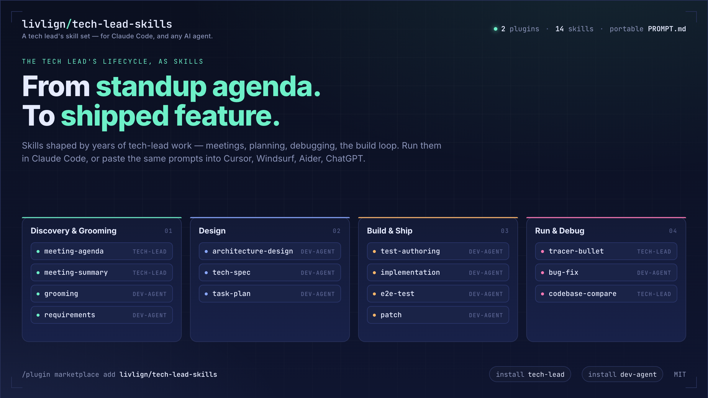

# tech-lead-skills



> A tech lead's skill set for Claude Code — *and any AI agent.* From standup agenda to shipped feature.

This repo collects skills shaped by years of tech-lead work into two installable plugins, plus portable `PROMPT.md` files next to every skill so the same content runs in **any** agent — Cursor rules, Windsurf, Aider, custom GPTs, paste-into-chat. Cross-agent index lives in [`AGENTS.md`](./AGENTS.md).

## Install

Inside Claude Code, add the marketplace once, then install either plugin:

```
/plugin marketplace add livlign/tech-lead-skills
/plugin install tech-lead@livlign
/plugin install dev-agent@livlign
```

| Plugin | What you get |
|---|---|
| [tech-lead](./plugins/tech-lead) | Weekly meeting agenda, meeting-notes summary, [tracer-bullet](./plugins/tech-lead/skills/tracer-bullet) debugging pattern (backend + frontend), two-pass codebase comparison report. |
| [dev-agent](./plugins/dev-agent) | Stack-agnostic build-loop orchestrator: [grooming](./plugins/dev-agent/skills/grooming) → [requirements](./plugins/dev-agent/skills/requirements) → [architecture](./plugins/dev-agent/skills/architecture-design) → [task plan](./plugins/dev-agent/skills/task-plan) → [tech spec](./plugins/dev-agent/skills/tech-spec) → [tests](./plugins/dev-agent/skills/test-authoring) → [implementation](./plugins/dev-agent/skills/implementation) → [e2e](./plugins/dev-agent/skills/e2e-test) → [patch](./plugins/dev-agent/skills/patch), with light reviewer gates. |

Not on Claude Code? Every skill ships a portable `PROMPT.md` next to its `SKILL.md` — paste it into Cursor, Windsurf, Aider, ChatGPT, or any other agent. See [`AGENTS.md`](./AGENTS.md).

## What it looks like

Once `tech-lead` is installed, ask Claude *"draft the agenda for today's standup"* — output below ↓

```
May 13, 2026 — Team 1: Product Intelligence
Updates

R202 UAT Deployed
* TKT-1250 Event Log
* TKT-1257 CSV Export

Doing this sprint
* TKT-1200 Data enablement - 90%
* TKT-1168 Simpler product creation
* TKT-1004 Rebrand - complete in S203?

Discovering
* TKT-1203 Public API - Confirm list APIs will be supported

Discussion
* Migration: pending confirmation from some customers
* Public API + Webhooks: walk through draft API list
* Customer feedback triage for H2 roadmap
```

The skill queries your ticket tracker, scans recent meeting notes for unresolved items, and produces a paste-ready agenda. Other skills produce similarly tight, opinionated output — `tracer-bullet` emits `[TRACER] {id} {Stage} — {Detail}` log lines you can grep end-to-end; `dev-agent` writes phase-by-phase markdown into `output/01-grooming.md`, `output/02-requirements.md`, … through `output/09-patch.md`.

## What this is for

Tech leads carry a workflow that no IDE understands by itself: chase the spec to use cases, talk to PMs in business words, write the architecture down so the QA can read it, hand the implementation to junior engineers without losing the locked-spec rule, debug a flaky integration with a single grep, run the weekly standup. The skills here encode that workflow.

The pitch is **not** "another code-completion plugin." These run *around* the IDE — meetings, planning, postmortems, debugging — and use the model the way a tech lead uses a smart pair: state the problem clearly, decide the shape, then delegate the build with gates.

## The lifecycle

```
        Discovery & Grooming          Design                  Build & Ship           Run & Debug
        ────────────────────         ──────────              ──────────────         ──────────────
                                                                                   
        meeting-agenda  ─────────►   architecture-design  ──► implementation  ───► tracer-bullet
        meeting-summary              tech-spec                test-authoring       codebase-compare
                                     task-plan                e2e-test
                                                              patch / bug-fix
                                     [via dev-agent orchestrator]
```

## Editing a skill

Single source of truth is `SKILL.md` (or `AGENT.md` for `dev-agent`). After any edit, regenerate the portable `PROMPT.md` files:

```bash
node scripts/build-prompts.mjs
```

See [`CONTRIBUTING.md`](./CONTRIBUTING.md) for the full workflow, and [`AGENTS.md`](./AGENTS.md) for per-agent install snippets.

## Status

Early. Real workflow distilled, but only two plugins ship today. Roadmap:

- [x] Hero visual (generated via the sibling [repo-visuals](https://github.com/livlign/claude-skills) plugin)
- [ ] Per-plugin READMEs with worked examples
- [ ] Skill-by-skill demo GIFs

Contributions welcome — see [CONTRIBUTING.md](./CONTRIBUTING.md).

## License

MIT — see [LICENSE](./LICENSE).
