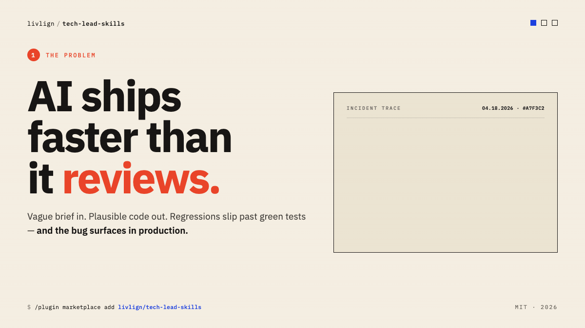

# tech-lead-skills



> A tech lead's skill set for Claude Code — *and any AI agent.* From standup agenda to shipped feature.

This repo collects skills shaped by years of tech-lead work into two installable plugins, plus portable `PROMPT.md` files next to every skill so the same content runs in **any** agent — Cursor rules, Windsurf, Aider, custom GPTs, paste-into-chat. Cross-agent index lives in [`AGENTS.md`](./AGENTS.md).

## Install

Inside Claude Code, add the marketplace once, then install either plugin:

```
/plugin marketplace add livlign/tech-lead-skills
/plugin install tech-lead@livlign
/plugin install dev-agent@livlign
```

| Plugin | What you get |
|---|---|
| [tech-lead](./plugins/tech-lead) | Weekly meeting agenda, meeting-notes summary, [tracer-bullet](./plugins/tech-lead/skills/tracer-bullet) debugging pattern (any multi-step flow — web, jobs, sagas, CLIs), two-pass codebase comparison report. |
| [dev-agent](./plugins/dev-agent) | Stack-agnostic build-loop orchestrator: [grooming](./plugins/dev-agent/skills/grooming) → [requirements](./plugins/dev-agent/skills/requirements) → [architecture](./plugins/dev-agent/skills/architecture-design) → [task plan](./plugins/dev-agent/skills/task-plan) → [tech spec](./plugins/dev-agent/skills/tech-spec) → [tests](./plugins/dev-agent/skills/test-authoring) → [implementation](./plugins/dev-agent/skills/implementation) → [e2e](./plugins/dev-agent/skills/e2e-test) → [patch](./plugins/dev-agent/skills/patch), with light reviewer gates. |

Not on Claude Code? Every skill ships a portable `PROMPT.md` next to its `SKILL.md` — paste it into Cursor, Windsurf, Aider, ChatGPT, or any other agent. See [`AGENTS.md`](./AGENTS.md).

## What it looks like

Once `tech-lead` is installed, ask Claude *"draft the agenda for today's standup"* — output below ↓

```
May 13, 2026 — Team A
Updates

Pre-prod Deployed
* TKT-1250 Feature One
* TKT-1257 Feature Two

Doing this sprint
* TKT-1200 Feature Three - 90%
* TKT-1168 Feature Four
* TKT-1004 Feature Six - complete this sprint?

Discovering
* TKT-1203 Public API - Confirm list APIs will be supported

Discussion
* Migration: pending confirmation from some customers
* Public API + Webhooks: walk through draft API list
* Customer feedback triage for next-half roadmap
```

The skill queries your ticket tracker, scans recent meeting notes for unresolved items, and produces a paste-ready agenda. Other skills produce similarly tight, opinionated output — `tracer-bullet` emits `[TRACER] {id} {Stage} — {Detail}` log lines you can grep end-to-end; `dev-agent` writes phase-by-phase markdown into `output/01-grooming.md`, `output/02-requirements.md`, … through `output/09-patch.md`.

## What this is for

Tech leads carry a workflow that no IDE understands by itself: chase the spec to use cases, translate engineering decisions into language stakeholders understand, write the architecture down so testers can read it, hand the implementation to less-senior engineers without losing the locked-spec rule, debug a flaky integration with a single grep, run the weekly standup. The skills here encode that workflow.

The pitch is **not** "another code-completion plugin." These run *around* the IDE — meetings, planning, postmortems, debugging — and use the model the way a tech lead uses a smart pair: state the problem clearly, decide the shape, then delegate the build with gates.

## Spec-driven development, for AI-assisted teams

The skills encode one core idea: **the spec is the contract; humans and AI both implement against it; gates between phases stop wrong premises from running away**. Each named pattern below is a specific way that idea shows up in the workflow.

### Shape of the loop

The dev-agent runs nine phases in three distinct rhythms — not nine linear steps:

```
1 → 2 → 3 → 4 → 5      linear setup        (one-shot per feature, human-readable)
        6              spec test contract  (one-shot, all tasks at once)
        7  ↻  T1 → T2 → … → TN   per-task iteration, reviewer gate per task
8 → 9                  linear close        (E2E then patch)
```

Phases 1–5 build the spec stack one document at a time. Phase 6 writes the entire failing-test contract for every task upfront and gets it approved. **Phase 7 is the iterative core**: pick the lowest-numbered `Todo` task, run the full suite (every prior `Done` task must still be green), implement, run the suite again, mark `Waiting review`, **stop**. The reviewer flips that one task to `Done`. Then the next task starts — small commit, narrow blast radius, every regression caught by an already-green test from a task you can't silently edit. Phases 8 and 9 close the loop with end-to-end verification and any final patches.

This is **TDD wrapped inside a spec contract**: the red comes from phase 6, the green from phase 7, and the reviewer gate between tasks is what keeps locked tests locked. Every AI phase (5–9) reads every upstream doc (1–4) — skipping any of them produces wrong output, because architecture defines the seams the tests stub against and requirements define what those tests assert.

### Tracer bullet — one id, end-to-end grep
*Skill: [tracer-bullet](./plugins/tech-lead/skills/tracer-bullet)*

Mint a unique `debugTraceId` at the entry point of any non-trivial flow (API call, job trigger, UI action, lambda, saga, worker-queue consumer, CLI run) and stamp **every** log line with `[TRACER] {id} {Stage} — {Detail}`. When something fails in production, paste the id, grep the log-search system, and the full call chain falls out — one keyword, every component the flow touched. Strip the lines in a dedicated commit before pre-release promotion so prod logs stay clean. Stack- and topology-agnostic; the marker stays the same whether the flow is a web request, a batch job, or a saga.

### Stub-and-driver test authoring — one unit per test
*Skill: [test-authoring](./plugins/dev-agent/skills/test-authoring)*

Every test isolates **exactly one unit**, defined by the boundaries on the architecture diagram. Stub downstreams by interface; drive the unit directly with its inputs; assert on its outputs *and* the calls it made to its stubs. If a unit can't be stub-driven, that's a design smell — surface it as a question, don't bend the test against the tangled shape. Integration tests follow the same rule at a coarser unit, with the real-vs-stubbed boundary named explicitly per test. A test that spins up the full graph is documenting the wrong shape.

### Spec doc before code — `06-tests.md` is the contract
*Skill: [test-authoring](./plugins/dev-agent/skills/test-authoring)*

`06-tests.md` is **authored, reviewed, and approved before any test code is written**. The doc names every AC ↔ test ↔ unit-under-test ↔ stub boundary in a table; the reviewer signs that table off; only then does code derive from it. If authoring surfaces that the spec was wrong, re-author the doc first, get re-approval, then regenerate code. The spec is authoritative; tests follow it, not the other way around.

### Locked-spec implementation — green-on-Done stays green
*Skill: [implementation](./plugins/dev-agent/skills/implementation)*

Once a task lands in `Done`, its tests are locked. Phase 7 (Implementation) runs task-by-task; before touching code for `T*K*`, every test for every already-`Done` task must still be green. If a prior task's test legitimately needs to change because of the current task, **stop** — lift to README `Pending` and wait for reviewer confirmation. Do not edit a locked test silently. This prevents the regression-by-stealth pattern where each commit silently adjusts the gate behind it.

### Entity-ownership map — write where it belongs
*Skill: [grooming](./plugins/dev-agent/skills/grooming)*

Every entity the task creates or mutates is mapped to its **owning service** (the canonical writer of that entity's lifecycle). If the task wants to write an entity that another service owns, the default answer is *"reuse the owner's writer via an internal call; do not reimplement"*. Reimplementation requires explicit reviewer authorization. Catches the cross-service drift where two services start writing the same entity through different paths.

### Precedent-citation discipline — no net-new without a sibling
*Skills: [grooming](./plugins/dev-agent/skills/grooming) and [architecture-design](./plugins/dev-agent/skills/architecture-design)*

For every new behaviour the task introduces (endpoint, cross-service hop, queue / event, popup flow, SQL seed pattern), cite the closest existing example in the codebase at `file:line`. If no precedent exists, flag it as **net-new architecture** — triggers a higher-bar review. Catches the case where the team already solved the problem and the new task is about to reinvent it.

## The lifecycle

```
        Discovery & Grooming          Design                  Build & Ship           Run & Debug
        ────────────────────         ──────────              ──────────────         ──────────────
                                                                                   
        meeting-agenda  ─────────►   architecture-design  ──► implementation  ───► tracer-bullet
        meeting-summary              tech-spec                test-authoring       codebase-compare
                                     task-plan                e2e-test
                                                              patch / bug-fix
                                     [via dev-agent orchestrator]
```

## Editing a skill

Single source of truth is `SKILL.md` (or `AGENT.md` for `dev-agent`). After any edit, regenerate the portable `PROMPT.md` files:

```bash
node scripts/build-prompts.mjs
```

See [`CONTRIBUTING.md`](./CONTRIBUTING.md) for the full workflow, and [`AGENTS.md`](./AGENTS.md) for per-agent install snippets.

## Status

Early. Real workflow distilled, but only two plugins ship today. Roadmap:

- [x] Hero visual (generated via the sibling [repo-visuals](https://github.com/livlign/claude-skills) plugin)
- [ ] Per-plugin READMEs with worked examples
- [ ] Skill-by-skill demo GIFs

Contributions welcome — see [CONTRIBUTING.md](./CONTRIBUTING.md).

## License

MIT — see [LICENSE](./LICENSE).
